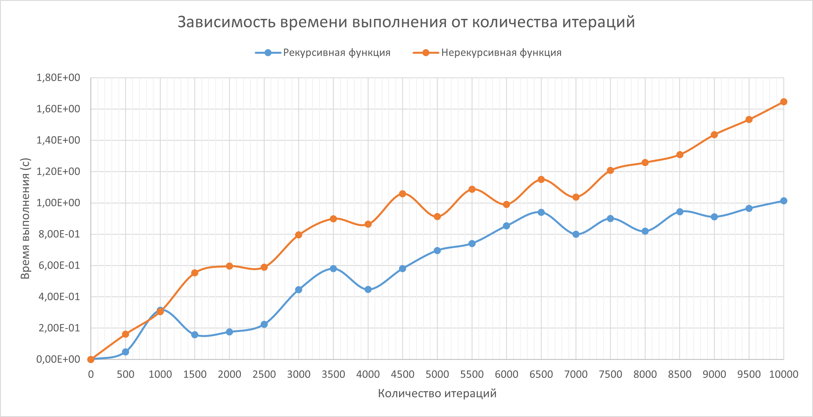

Отчет о проделанной работе
=
1. Перенос рекурсивной версии построения бинарного дерева из ЛР1. Доработка: функции для левого и правого шага стали задаваться "извне" функции, параметрически.
2. Разбор и преобразование кода преподавателя по нерекурсивной версии построения бинарного дерева.
3. Реализация тестирования функций с подходящими, граничащими и неподходящими значениями.
4. Сравнение реализации рекурсивной и нерекурсивной функции по построению бинарного дерева с точки зрения эффективности работы алгоритма.

Сравнение реализации рекурсивной и нерекурсивной функции
-
1. Реализация функции для измерения времени выполнения рекурсивной и нерекурсивной функции
2. Реализация функции для записи в лог-файл
3. Выставение шага между количеством итераций
4. Систематизация данных из лог-файла и построение графика зависимости времени выполнения (ось OY) от количества итераций (ось OX):

Выводы
-
Исходя из графика зависимости времени выполнения функций от количества итераций, можно сделать вывод, что рекурсивная функция с точки зрения эффективности лучше нерекурсивной. 

Предпочтительно выбирать количество итераций до 500, так как дальше идет значительно резкий рост времени, затраченного на выполнение.